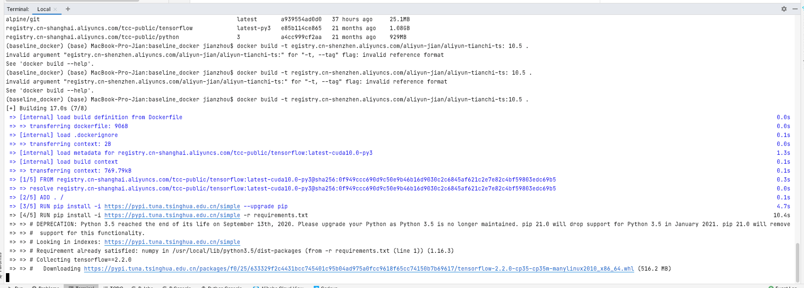
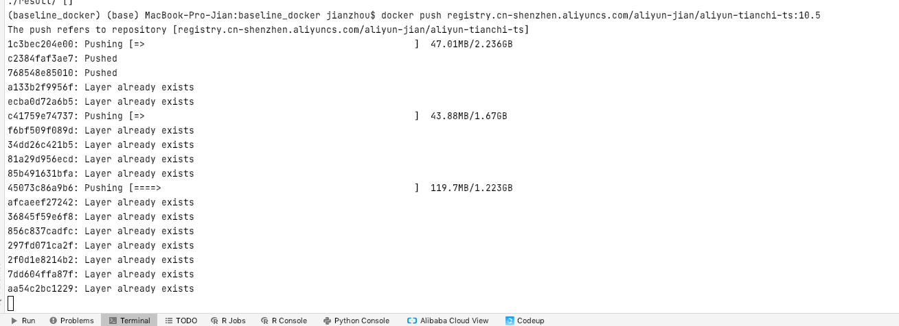
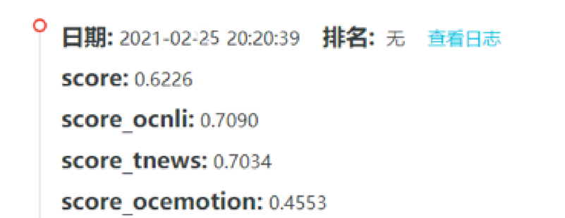

### Feb 22th 打卡学习记录

一开始把Aliyun和Docker账号搞混了，出了很多模型奇妙的bug \
最后还是好不容易在最后关头跑通了。。太难了我的天。

build image via pycharm terminal 

push image to my registry

成功记录
score： 0.57

### Feb 25th 打卡学习记录

试着改进模型，让模型输入两个句子，
但分数没太有改进

